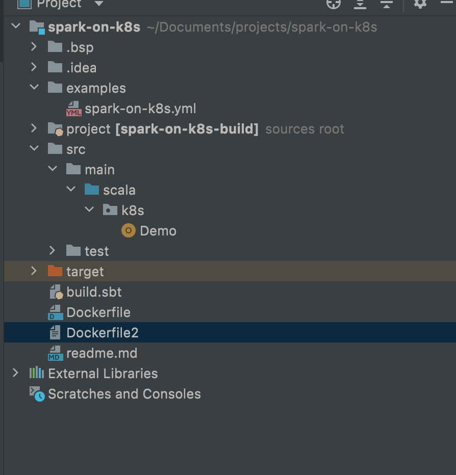

# spark-on-k8s
# spark on k8
Spark scala code,that we are going to run on kubernates

## Project structure



## Set up for packaging
1. Create a project folder.
   2.Create a project.sbt file inside project folder and add a sbt plugin. This is required for building a flat jar
    ```$xslt
    addSbtPlugin("com.eed3si9n" % "sbt-assembly" % "0.14.10")
    addSbtPlugin("net.virtual-void" % "sbt-dependency-graph" % "0.9.2")
    ```
2. Create a build.properties file inside project folder and add a sbt version.
    ```$xslt
    sbt.version = 1.5.5
    ```
3. In build.sbt, add the task for merge strategy.
    ```$xslt
    assemblyMergeStrategy in assembly := {
      case "META-INF/services/org.apache.spark.sql.sources.DataSourceRegister" => MergeStrategy.concat
      case PathList("META-INF", xs@_*) => MergeStrategy.discard
      case "application.conf" => MergeStrategy.concat
      case x => MergeStrategy.first
    }
    ```
4. Create the Docker file

## Build docker images locally/Online
1. docker build -f Dockerfile -t demo/spark-on-k8s:latest .

## View the content of the images
1. docker run -it demo/spark-on-k8s:latest sh

## Deploy the code on K8 using docker image
```$xslt
kubectl apply -f examples/spark-on-k8s.yml 
```

## See the list of pods running
```$xslt
   kubectl get pod   
```

##See the log of the pod
```$xslt
   kubectl logs spark-on-k8s2-driver -f
```
References
[Migrate spark from emr to EKS](https://itnext.io/migrating-apache-spark-workloads-from-aws-emr-to-kubernetes-463742b49fda)  
[EMR-on-EKS-DevelopmentGuide](https://docs.aws.amazon.com/emr/latest/EMR-on-EKS-DevelopmentGuide/setting-up.html)  
[Kubernates workshop](https://github.com/aws-samples/aws-workshop-for-kubernetes)  
[Sample Example](https://github.com/aws-samples/amazon-eks-apache-spark-etl-sample)

Note: Spark,SBT and Scala versions should be match with infrastructure and code vice versa